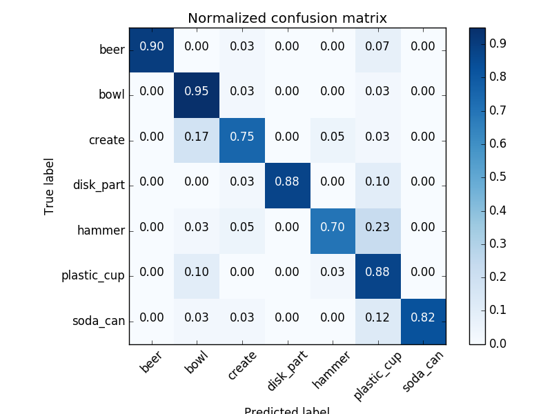
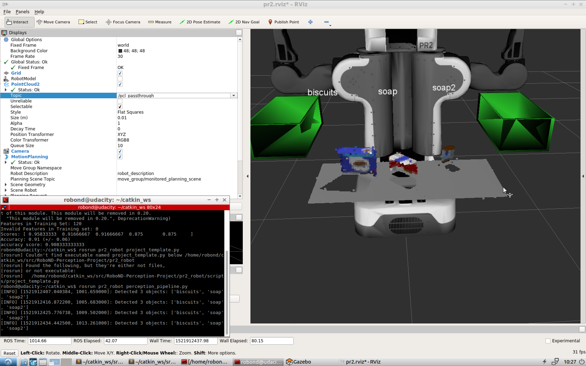
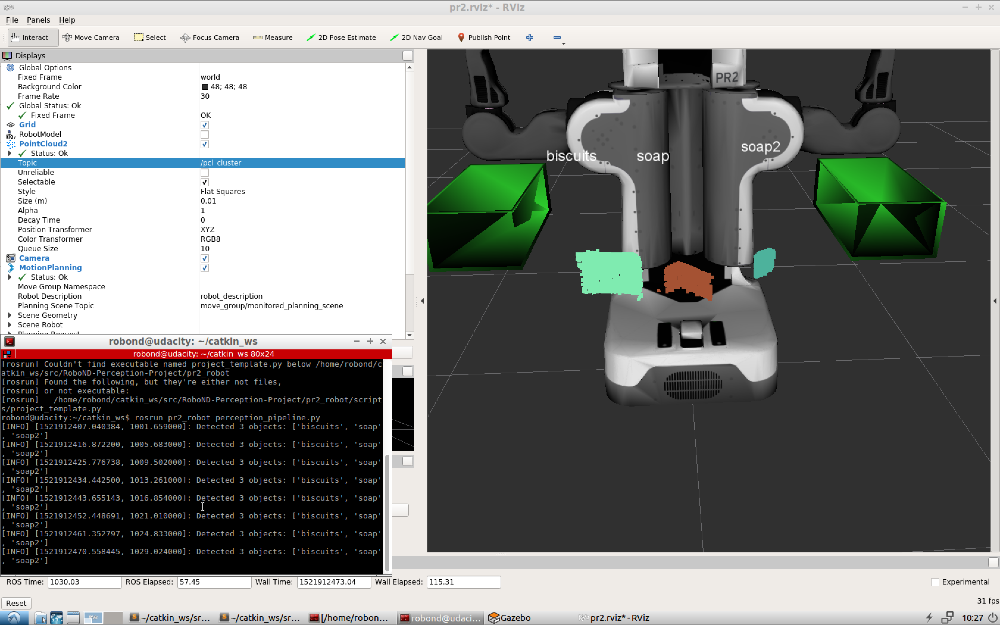
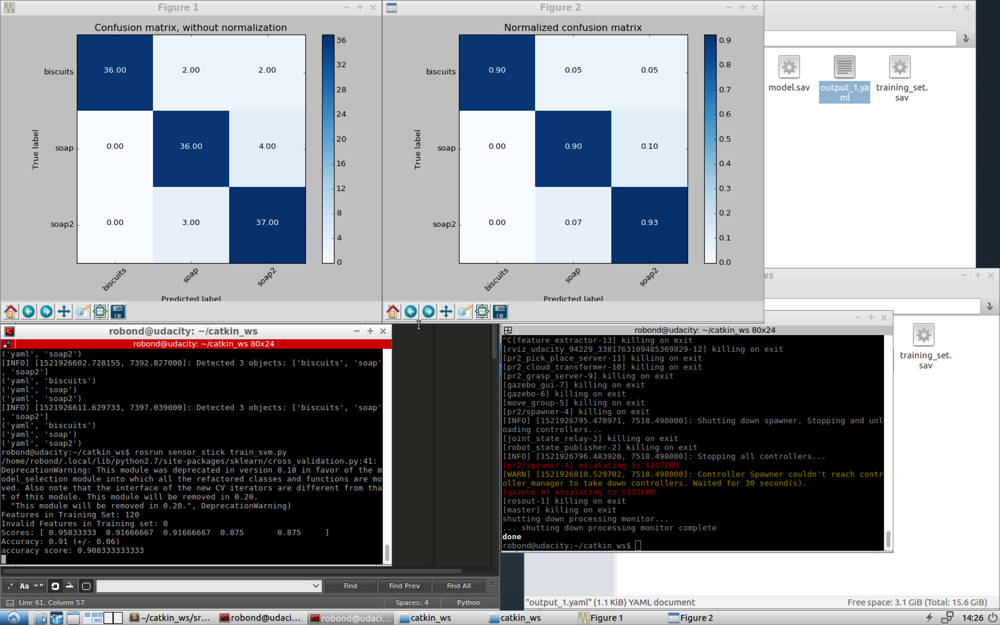
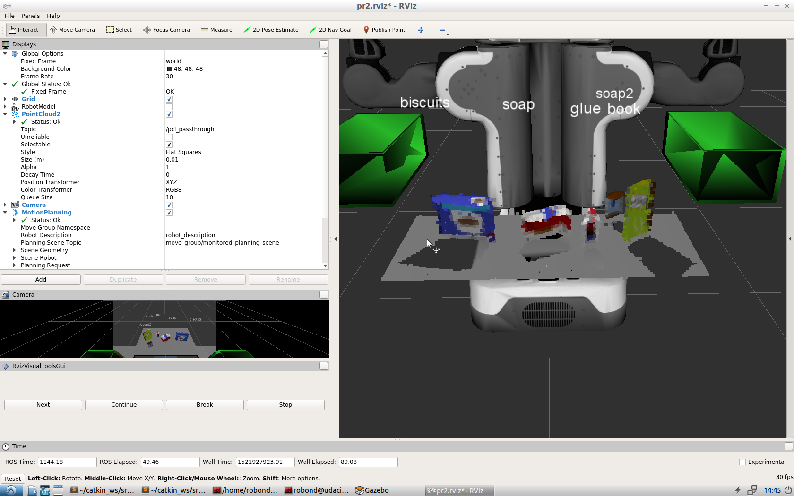
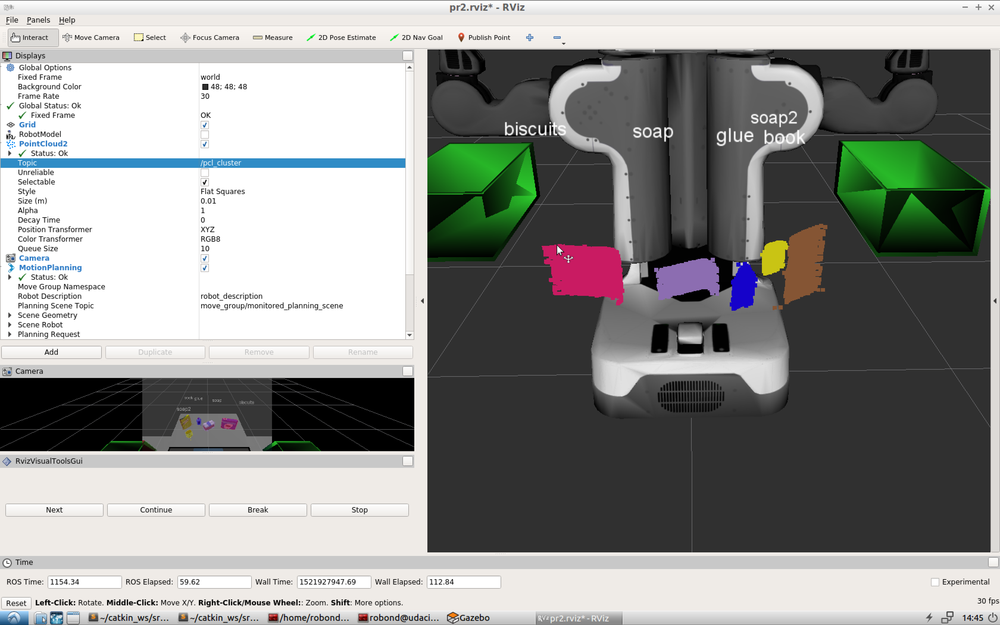
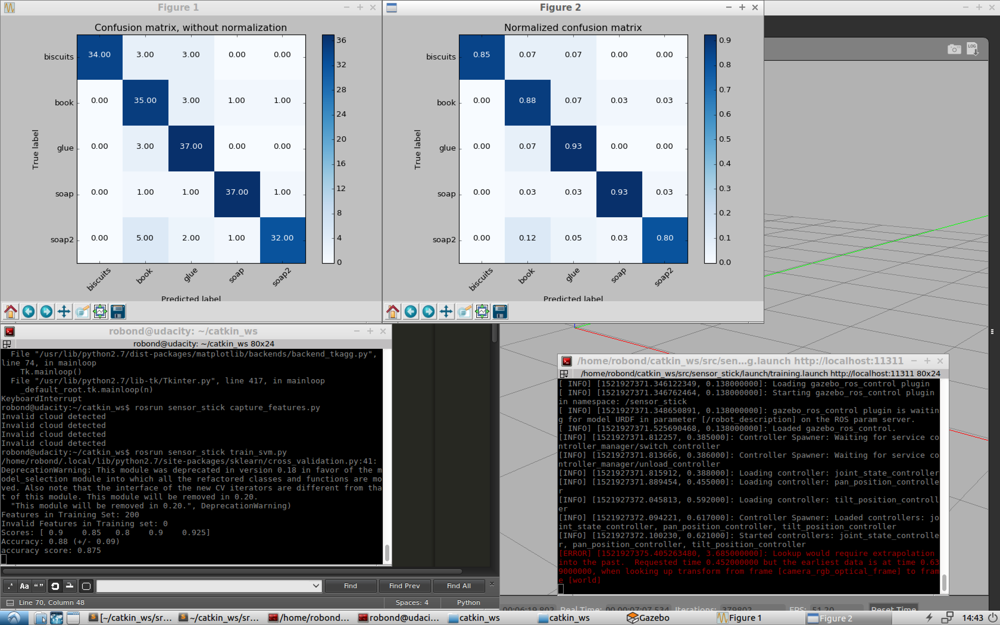
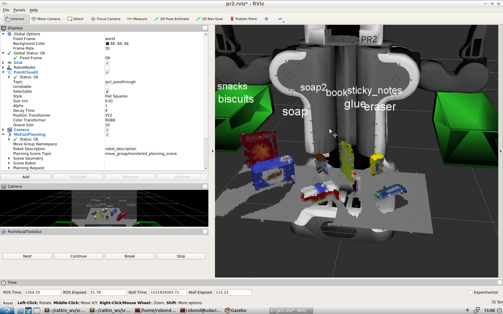
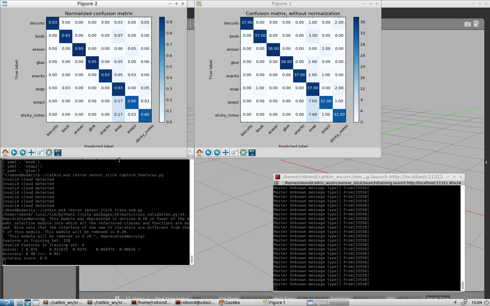

# 3D Perception

Complete Exercise 1 steps. Pipeline for filtering and RANSAC plane fitting implemented.

The pcl_callback() function within the template Python script has been filled out to include filtering and RANSAC plane fitting. 
___
Please reference `RoboND-Perception-Exercises/Exercise-1/RANSAC.py`
___
Complete Exercise 2 steps: Pipeline including clustering for segmentation implemented.

Steps for cluster segmentation have been added to the pcl_callback() function in the template Python script. 
___
Please reference `RoboND-Perception-Exercises/Exercise-2/sensor_stick/scripts/segmentation.py`
___
Complete Exercise 3 Steps. Features extracted and SVM trained. Object recognition implemented.

Both compute_color_histograms() and compute_normal_histograms() functions have been filled out and SVM has been trained using train_svm.py. Please provide a snapshot of your normalized confusion matrix (output from train_svm.py in your writeup / README. Object recognition steps have been implemented in the pcl_callback() function within template Python script. 
___
Please reference:
- `RoboND-Perception-Exercises/Exercise-3/sensor_stick/scripts/capture_features.py`
- `RoboND-Perception-Exercises/Exercise-3/sensor_stick/scripts/train_svm.py`
- `RoboND-Perception-Exercises/Exercise-3/sensor_stick/src/sensor_stick/features.py`
- `RoboND-Perception-Exercises/Exercise-3/sensor_stick/scripts/object_recognition.py`

Some keys changes included:
- increasing the number of captured poses as features from 5
- using a `sigmoid` kernel instead of linear for the SVM

The following confusion matrices resulted:


```
Features in Training Set: 280
Invalid Features in Training set: 0
Scores: [ 0.85714286  0.80357143  0.82142857  0.82142857  0.89285714]
Accuracy: 0.84 (+/- 0.06)
accuracy score: 0.839285714286
```

___
For all three tabletop setups (test*.world), perform object recognition, then read in respective pick list (pick_list_*.yaml). Next construct the messages that would comprise a valid PickPlace request output them to .yaml format.

You can add this functionality to your already existing ros node or create a new node that communicates with your perception pipeline to perform sequential object recognition. Save your PickPlace requests into output_1.yaml, output_2.yaml, and output_3.yaml for each scene respectively. Add screenshots in your writeup of output showing label markers in RViz to demonstrate your object recognition success rate in each of the three scenarios. Note: for a passing submission, your pipeline must correctly identify 100% of objects in test1.world, 80% (4/5) in test2.world and 75% (6/8) in test3.world.
___
Please reference `src/RoboND-Perception-Project/pr2_robot/scripts/perception_pipeline.py`.

The following screenshots were taken from worlds 1, 2, and 3, respectively, showing that all objects were correctly identified.

## World 1




## World 2




## World 3


